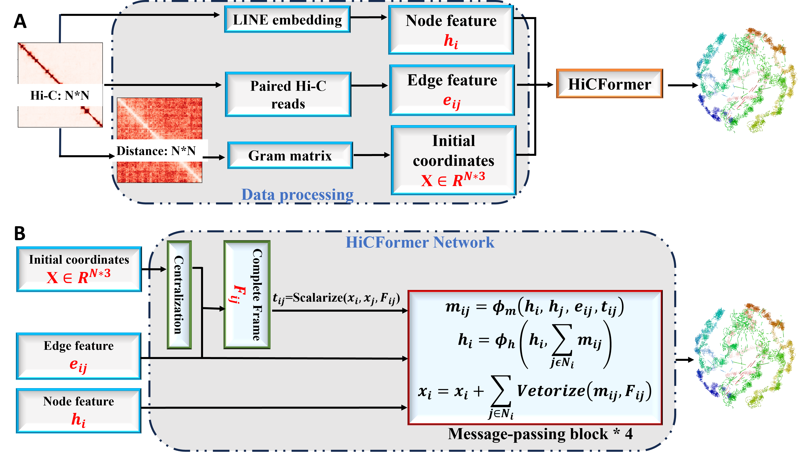

<div align="center">

# HiCFormer
A transformer method of reconstructing 3D structures of genomes and chromosomes from Hi-C data



</div>

## Description
The directory contains the code used to run the experiments and our own models for the paper

## HiC dataset used in the paper

```
The Cooler file dataset for Human cells with GEO number GSE130711 can be get from https://salkinstitute.app.box.com/s/fp63a4j36m5k255dhje3zcj5kfuzkyj1 or more detailed Human single-cell data at https://salkinstitute.app.box.com/s/fp63a4j36m5k255dhje3zcj5kfuzkyj1/folder/82405563291
The Cooler file format dataset for Drosophila was obtained from GEO with code GSE131811 can be get from https://www.ncbi.nlm.nih.gov/geo/query/acc.cgi?acc=GSE131811 
```
## Dependencies

HiCDFormer is written in Python3 and uses the Pytorch module. 
The dependencies can be installed by the following command:

```bash
# create conda environment
conda env create -f HiCFormer.yml

# active the environment
conda active HiCFormer
```

## Preparing datasets
```bash
# First step create folder for the datasets, the 'Datasets' folder should be at the same level as 'TrainingYourData' Folder 
mkdir -p Datasets/Human
# or
mkdir -p Datasets/Drosophila 

# Second download the dataset to Datasets/Human or Datasets/Drosophila the by the given link

# Third check the download files' extension, if not .mcool extension, you should zoomify the files to get the resolution you want
cooler zoomify --balance filename.cool

# Fourth name the zoomified file to the customized name as bellow
mv fiilename.mcool cell1_name.mcool
# note: you can replace the numerical number as any interger you want, and change the 'name' as you want.
```


## Process dataset

## Inference HiCDFormer

If you want to retrain your dataset, YOU can run HiCFormer by the following command:

```bash

```


## Train HiCDFormer

If you want to retrain your dataset, YOU can run HiCFormer by the following command:

```bash

```

## Developer

```
Yanli Wang
Deparment of Computer Science
University of Missouri
Columbia, MO 65211, USA
Email: yw7bh@missouri.edu
```

## Contact

```
Jianlin (Jack) Cheng, PhD
William and Nancy Thompson Distinguished Professor
Department of Electrical Engineering and Computer Science
University of Missouri
Columbia, MO 65211, USA
Email: chengji@missouri.edu
```
